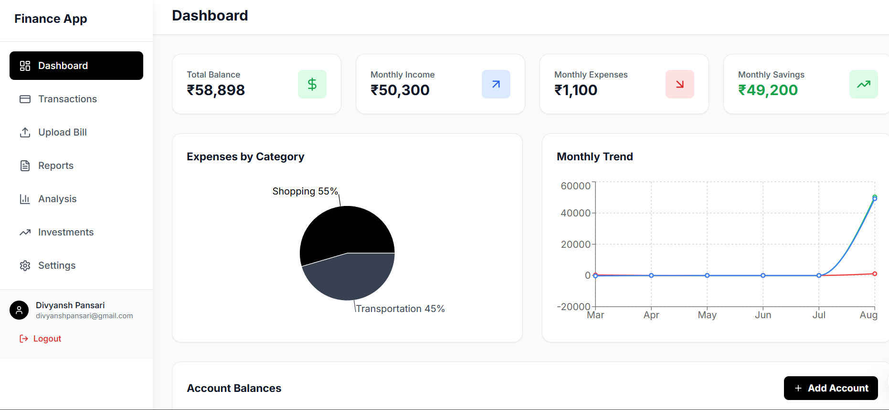
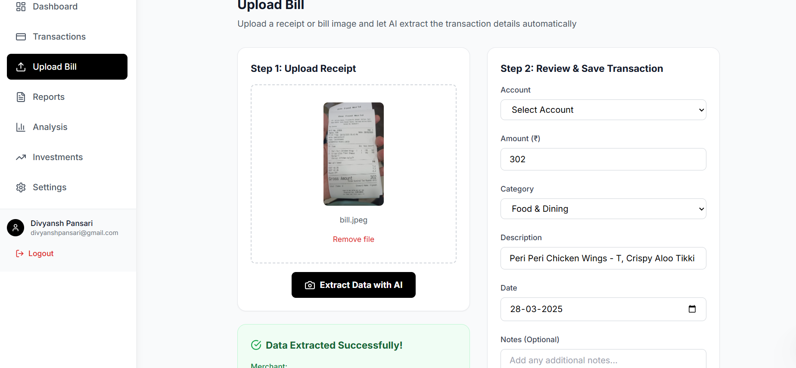
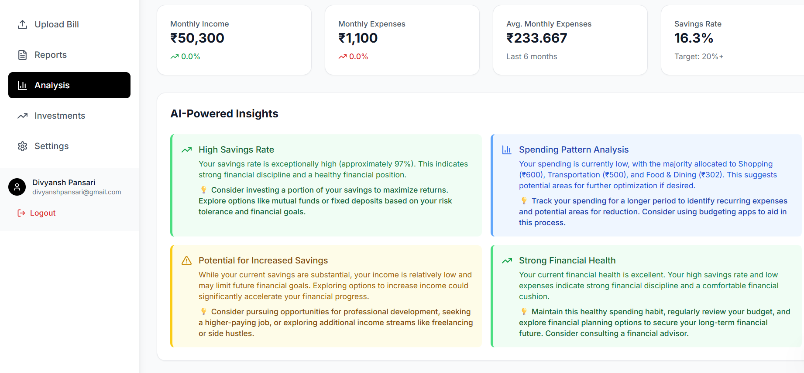

# Personal Finance Management App

A comprehensive personal finance management application built with React, TypeScript, Firebase, and Gemini AI integration.

## Features

### 🔐 Authentication
- Email & password authentication
- Google OAuth integration
- Secure user session management

### 💳 Multi-Bank Account Support
- Add multiple bank accounts
- Track balances in Indian Rupees (₹)
- Account management (update/delete)

### 💰 Transaction Management
- Add, edit, and delete income/expense transactions
- Categorize transactions
- Link transactions to specific accounts
- Add notes and descriptions

### 📊 Smart Receipt Processing
- Upload receipt/bill images
- AI-powered data extraction using Gemini API
- Auto-fill transaction details
- Manual review and editing before saving

### 📈 Interactive Dashboard
- Real-time financial overview
- Pie charts for expense categories
- Line charts for spending trends
- Account balance summaries
- Monthly savings analysis

### 🧠 AI-Powered Analysis
- Spending pattern analysis
- Personalized financial insights
- Savings recommendations
- Trend identification

### 📄 Reports & Exports
- Monthly/yearly financial reports
- PDF report generation
- CSV export functionality
- Transaction history downloads

### 📈 Investment Portfolio
- Track stocks, mutual funds, crypto
- Portfolio performance monitoring
- Gain/loss calculations
- Investment distribution charts

## Tech Stack

- **Frontend**: React 18, TypeScript, Tailwind CSS
- **Animation**: Framer Motion
- **Charts**: Recharts
- **Backend**: Firebase (Auth + Firestore)
- **AI**: Google Gemini API
- **Forms**: React Hook Form with Yup validation
- **PDF Generation**: jsPDF
- **Build Tool**: Vite

## Getting Started

### Prerequisites

1. Node.js (v16 or higher)
2. Firebase project
3. Gemini API key

### Installation

1. Clone the repository
2. Install dependencies:
   ```bash
   npm install
   ```

3. Set up Firebase:
   - Create a Firebase project
   - Enable Authentication (Email/Password and Google)
   - Create a Firestore database
   - Copy your Firebase config to `src/lib/firebase.ts`

4. Set up Gemini AI:
   - Get your Gemini API key from Google AI Studio
   - Add environment variables for API integration

5. Start the development server:
   ```bash
   npm run dev
   ```

## Firebase Configuration

Replace the Firebase config in `src/lib/firebase.ts` with your project details:

```typescript
const firebaseConfig = {
  apiKey: "your-api-key",
  authDomain: "your-auth-domain",
  projectId: "your-project-id",
  storageBucket: "your-storage-bucket",
  messagingSenderId: "your-messaging-sender-id",
  appId: "your-app-id"
};
```

## Database Structure

### Collections

#### `accounts`
```typescript
{
  id: string;
  userId: string;
  name: string;
  type: string;
  balance: number;
  createdAt: Date;
}
```

#### `transactions`
```typescript
{
  id: string;
  userId: string;
  accountId: string;
  type: 'income' | 'expense';
  amount: number;
  category: string;
  description: string;
  date: Date;
  notes?: string;
  receiptUrl?: string;
  createdAt: Date;
}
```

#### `investments`
```typescript
{
  id: string;
  userId: string;
  name: string;
  type: 'stock' | 'mutual_fund' | 'crypto' | 'gold' | 'sip' | 'other';
  quantity: number;
  buyPrice: number;
  currentPrice: number;
  createdAt: Date;
}
```

## Security Rules

Make sure to set up proper Firestore security rules:

```javascript
rules_version = '2';
service cloud.firestore {
  match /databases/{database}/documents {
    match /{collection}/{document} {
      allow read, write: if request.auth != null && request.auth.uid == resource.data.userId;
    }
  }
}
```

## Building for Production

```bash
npm run build
```
## Sample Screenshots

### Authentication & Dashboard


### Transaction Management & Receipt Processing


### Investment Portfolio & Reports


## Contributing

1. Fork the repository
2. Create your feature branch
3. Commit your changes
4. Push to the branch
5. Create a Pull Request

## License

This project is licensed under the MIT License.
